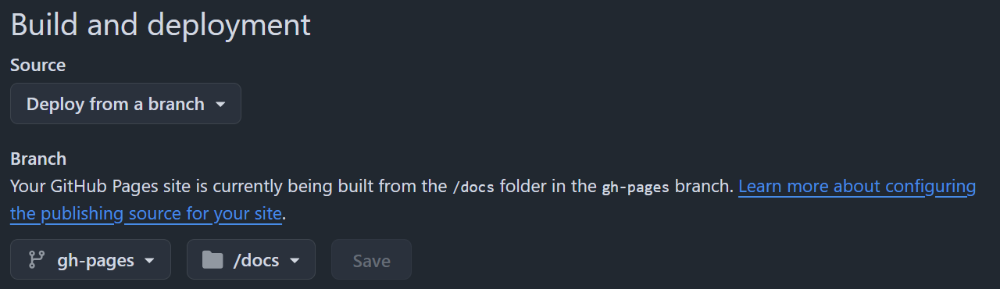

## Usage

This chart is expected to be used with the [Crossplane provider for AWS Secrets Manager](https://marketplace.upbound.io/providers/upbound/provider-aws-secretsmanager/v1.20.1)
and consumed via an ArgoCD Application of type helm, created via
[Crossplane provider-kubernetes Object](https://github.com/crossplane-contrib/provider-kubernetes/blob/main/examples/object/object-watching.yaml)
```yaml
apiVersion: kubernetes.crossplane.io/v1alpha2
kind: Object
metadata:
  name: foo
  annotations:
    uptest.upbound.io/post-assert-hook: testhooks/validate-watching.sh
    uptest.upbound.io/timeout: "60"
spec:
  watch: true
  references:
  # Use patchesFrom to patch field from other k8s resource to object defined in .spec.forProvider.manifest
  - patchesFrom:
      apiVersion: v1
      kind: Secret
      name: bar
      namespace: default
      fieldPath: metadata.resourceVersion # field that changes every time the object is modified
    toFieldPath: spec.source.helm.valuesObject.nameSuffix
  forProvider:
    manifest:
      apiVersion: argoproj.io/v1alpha1
      kind: Application
      metadata:
        name: bar
        namespace: argocd
      spec:
        project: default
        source:
          chart: aws-secrets-manager-secret
          repoURL: https://baburciu.github.io/aws-secrets-manager-secret/
          targetRevision: 0.2.0
          helm:
            valuesObject:
              fullnameOverride: ekscert
              region: us-east-1
              secret:
                key: key
                name: bar
                namespace: default
        destination:
          server: https://kubernetes.default.svc
          namespace: default
        syncPolicy:
          automated:
            prune: true
            selfHeal: true
          syncOptions:
            - CreateNamespace=true
            - RespectIgnoreDifferences=true
  providerConfigRef:
    name: provider-kubernetes
---
apiVersion: v1
kind: Secret
metadata:
  name: bar
  namespace: default
stringData:
  key: some-value
```

## Pushing chart

### Create Helm Chart Package and Registry

```shell
git checkout -b gh-pages

# Create a docs folder in your repo
mkdir docs

# Package chart to docs folder
helm package . --destination docs

# Create index file
helm repo index docs --url https://baburciu.github.io/aws-secrets-manager-secret/

# These commands create:
# - A .tgz package of your chart
# - An index.yaml file for the chart repository

# Commit and push
git add docs
git commit -m "Add Helm chart package"
git push

# Enable GitHub Pages in repo settings https://github.com/baburciu/aws-secrets-manager-secret/settings/pages, pointing to /docs folder
```


### ArgoCD application

```yaml
apiVersion: argoproj.io/v1alpha1
kind: Application
spec:
  project: default
  source:
    chart: aws-secrets-manager-secret
    repoURL: https://baburciu.github.io/aws-secrets-manager-secret/
    targetRevision: 0.2.0
```
